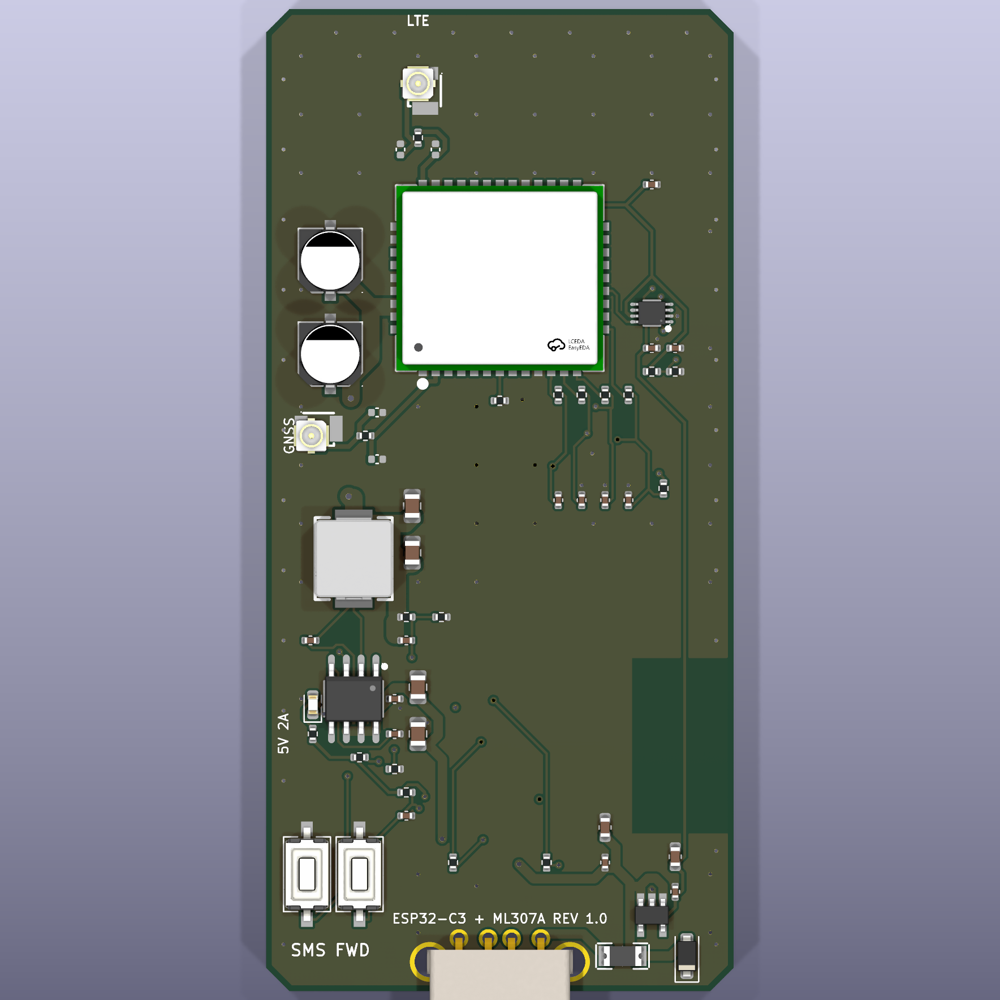
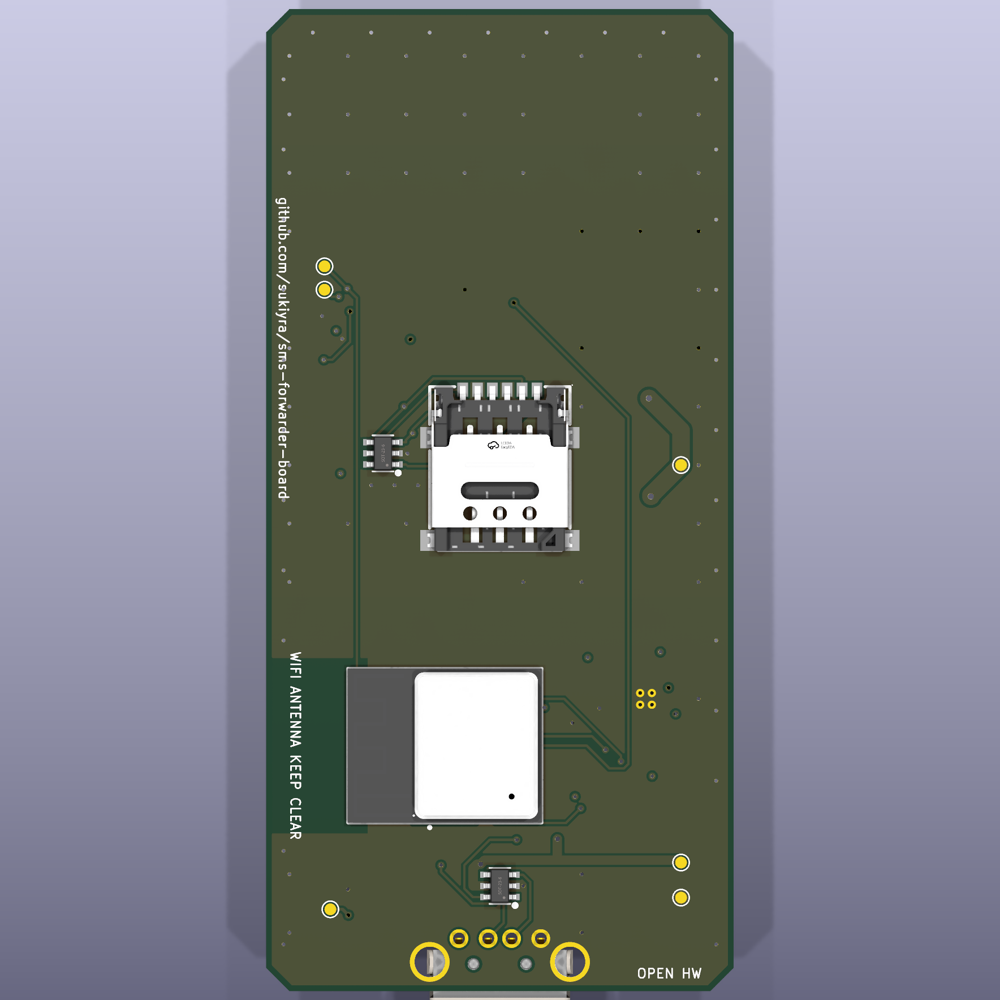

# SMS Forwarder Board Rev 1.0

这是与本仓库固件配套的 USB 棒形短信转发硬件。主控为 ESP32-C3-MINI-1，蜂窝模组为 ML307A-DSLN；ML307A-DCLN 可作为不需要 GNSS 时的替代料。工程使用 KiCad 10 创建，制造文件按立创/JLCPCB 四层板工艺导出。

Rev 1.0 是等待首板验证的工程样板。KiCad 10.0.6 ERC 与 DRC 均为 0 错误、0 警告、0 未连接，但这不能替代实体板的电源瞬态、射频、热、SMT 焊接和运营商网络测试。建议先下单 5 块裸板、贴装 2 块，完成 [装配与验证步骤](ASSEMBLY.md) 后再量产。

## 主要特性

- 40 mm × 84 mm 四层 PCB，USB-A 直插供电与原生 USB 下载。
- ESP32-C3 GPIO3/GPIO4 通过 TXU0202 与 ML307 的 1.8 V UART0 相连。
- ESP32-C3 GPIO5 控制 SY8205 的 EN，实现固件需要的模组硬断电重启。
- ML307 独立 3.816 V 同步降压电源，模组旁配置 2 × 220 µF 低 ESR 储能电容。
- Nano SIM 卡座、四路 SIM ESD、22 Ω 串联阻尼及 DATA 上拉。
- LTE MAIN 与可选 GNSS 两个 U.FL 接口，均预留 π 型匹配位。
- RESET、BOOT 按键和量产测试点。

## 文件目录

| 文件 | 用途 |
| --- | --- |
| `sms_forwarder_ml307a/` | KiCad 10 原理图、PCB、工程文件和 Specctra DSN |
| `libs/` | 项目专用符号、封装与 3D 模型 |
| `manufacturing/SMS-Forwarder-ML307A-Gerber.zip` | 可上传到立创下单页的 Gerber/钻孔压缩包 |
| `manufacturing/bom/BOM_JLCPCB.csv` | 立创 SMT BOM |
| `manufacturing/bom/BOM_Full.csv` | 含 DNP、手焊件与测试焊盘的完整 BOM |
| `manufacturing/bom/SMS-Forwarder-BOM.xlsx` | 便于采购、替代料和备注管理的 BOM |
| `manufacturing/pick-and-place/CPL_JLCPCB.csv` | JLC 标准列名的双面贴片坐标 |
| `drawings/schematic.pdf` | 原理图 PDF |
| `drawings/pcb-layout.pdf` | PCB 顶层装配图 |
| `tools/generate_hardware.py` | 重新生成器件布局、网表、DSN 与 BOM |

## 模组兼容性

本 PCB Rev 1.0 的焊盘仅适用于 **ML307A 94-pin 封装**。ML307C 与 ML307Y 使用 109-pin LCC+LGA 封装，虽然固件能够在运行时识别 A/C/Y 并选择兼容 AT 指令，但它们不能直接焊到本版 ML307A 焊盘上。C/Y 需要单独的 109-pin PCB 变体，不能通过软件解决封装差异。

这一区分也适用于量产：在贴片订单里必须把 `ML307A-DSLN / C5375091` 或 `ML307A-DCLN / C5362285` 与 PCB 版本绑定，不能让工厂按库存替换成 ML307C/Y。

## 立创下单参数

- 板层：4 层
- 板厚：1.6 mm
- 外层铜厚：1 oz
- 内层铜厚：0.5 oz
- 推荐叠层：JLC04161H-7628
- 阻抗：LTE/GNSS 走线按 50 Ω 单端复核；USB D+/D− 按 90 Ω 差分复核
- 表面处理：沉金 1U" 或无铅喷锡
- 阻焊/丝印：绿色/白色
- 最小信号线宽/间距：0.20/0.18 mm；局部接地扇出 0.15 mm
- 最小过孔：0.60/0.30 mm；模组电源过孔 1.00/0.50 mm
- 拼板：首轮不要拼板，先做 5 片工程样板

下单时选择与工程一致的阻抗叠层，并在阻抗计算器中重新确认最终线宽。立创可能调整材料批次或阻抗补偿，制造端给出的补偿值优先于工程中的名义线宽。

`BOM_JLCPCB.csv` 和 `CPL_JLCPCB.csv` 可直接用于 SMT 询价。USB-A 插头 J1 标为手焊件，RF 匹配电容 C23–C26 标为 DNP，测试点不会出现在贴片坐标中。立创导入后仍要逐项核对器件方向，特别是 U1、U2、J2、D1、D2、U3、U5、U6 和 U7。

## 供电要求

ML307 在 LTE 发射时会产生接近 2 A 的峰值电流。USB 电源必须能持续提供 5 V/2 A，并使用低阻 USB 接口或短延长线。普通电脑 USB 2.0 端口可能限流，表现为模组掉线、收不到短信、来电提示关机或反复注册。

板上 2 A 自恢复保险用于故障保护，不代表任意电脑 USB 端口都能提供 2 A。调试时应在 `TP1/+5V` 和 `TP2/+3V8_MODEM` 测量最低电压；模组发射期间 3.8 V 电源不能跌破 3.4 V。

## 首板验证

首批仅贴装 2 片，按 [装配与验证步骤](ASSEMBLY.md)逐项验收。通过电源纹波、UART、电流峰值、SIM、三网驻网、收发短信、Wi-Fi 和 24 小时压力测试后，再放开批量贴片。

## 重新生成

安装 KiCad 10 后运行 `hardware/tools/generate_hardware.py` 可重新生成放置完成的 PCB、DSN 和 CSV BOM。使用 Freerouting 1.6.5 对 DSN 布线后，以 `hardware/tools/import_freerouting.py` 导回 KiCad，再运行 `hardware/tools/generate_schematic.py` 和 KiCad CLI 导出制造资料。仓库内提交的 `.kicad_pcb` 已包含最终布线，不需要为了下单重新运行生成脚本。

## 许可证

`hardware/` 下的硬件源文件与制造资料使用 [CERN-OHL-P-2.0](LICENSE-CERN-OHL-P-2.0.txt)。仓库其余固件和量产工具继续使用根目录 MIT License。

## 设计依据

- [Espressif ESP32-C3 硬件设计指南](https://documentation.espressif.com/esp-hardware-design-guidelines/en/latest/esp32c3/index.html)
- [ESP32-C3-MINI-1/-1U 数据手册](https://documentation.espressif.com/esp32-c3-mini-1_datasheet_en.html)
- [JLCPCB 四层阻抗叠层](https://jlcpcb.com/impedance)
- ML307A Hardware Design Manual V1.0.1（仓库不再分发供应商手册；请从模组供应商取得当前版本）
